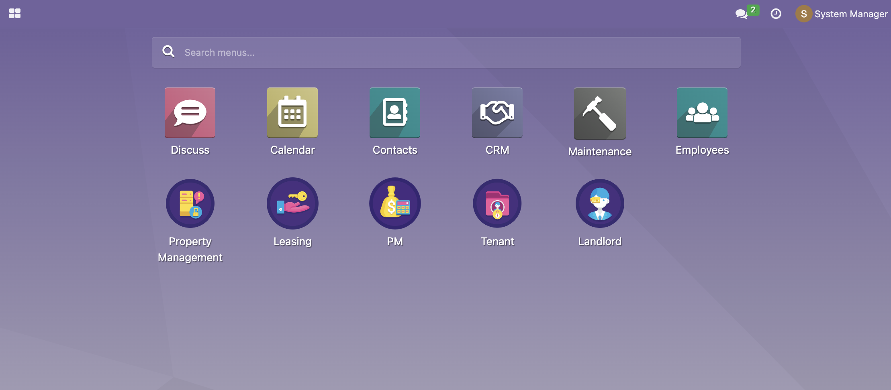

## Property Management
## Contact: [Website KoiERP](https://koierp.com/) or Email [thanhkoierp@gmail.com](mailto:thanhkoierp@gmail.com)

******

### Management Apartments, Rental, Rental agency, Entrust and Fees (electric, water, rent, ...etc).
### Include: Tenant Contract, Landlord Contract, Entrust Contract, PM Contract and Maintenance.
### Leasing user screen

### Apartment Manager user screen

### Apartment Screen

### Landlord Partner screen

### Tenant Partner screen

### Landlord contract have two flows:
#### 1. Normal Contract: PM or Entrust contract must be created and status is In progress.
#### 2. Entrust Contract: Entrust contract must be created and status is In progress.
*** 
Tenant contract be signed, the system auto:

    Create Landlord contract.
    Create Commision with Landlord, and deducting commission in Rent cost and Management fee until the full amount of the commission.
    Create Fee Schedule follow Start date and End date include: Rent cost, Management fee, Appartment fee (case apartment available before, require PM contract must In progress)
Leasing user create Deposit and Accounting user create payment follow amount receive.

Leasing user create invoice from Fee Schedule, the system auto:

    Create invoice in Fee Schedule of Landlord contract, PM or Entrust contract follow Start date from Schedule
### Screens
* Tenant contract:

* Deposit Tenant contract:

* Landlord contract:

* PM contract:

***

#### 2. Entrust Contract: must require Entrust contract (In progress)
*** 
When Tenant contract be signed, the system auto:

    Create Fee Schedule follow Start date and End date include: Rent cost, Management fee, Appartment fee (case apartment available before, require PM contract must In progress)
Leasing user create Deposit and Accounting user create payment follow amount receive.

When Leasing user create invoice from Fee Schedule, the system auto:

    Create invoice in Fee Schedule of Landlord contract, PM or Entrust contract follow Start date from Schedule
***